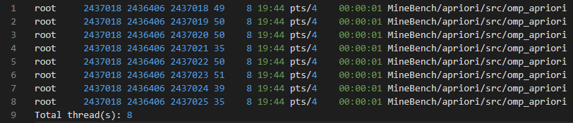
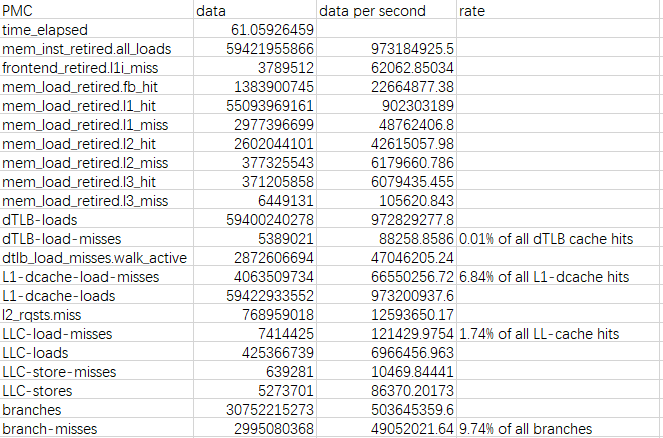
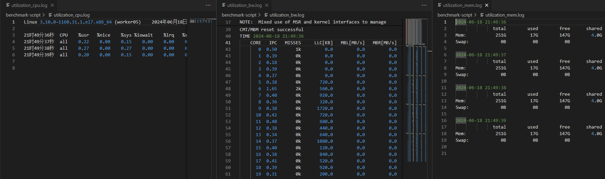
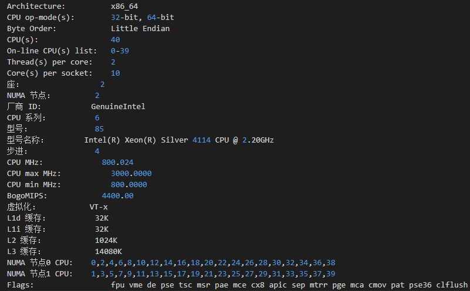
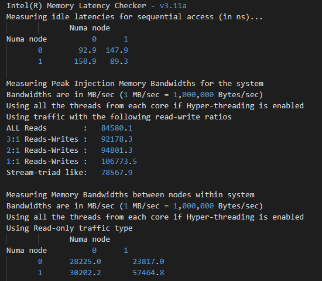
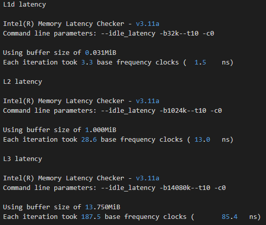

# benchmark-script

使用时请确保当前终端有root权限

## 并发效率

concurrency.py

通过`ps -efL | grep <pid>` 查看进程中的并发线程。

用法: `python concurrency.py --pid <pid>`

输出: 进程当前运行的线程列表(concurrency.log)

<div align="center">
  
</div>


## perf相关(访存效率、缓存效率、分支效率、不同层次缓存访问缺失率)

perf_test.py

`perf stat -e events_name [-p <pid> | -G <cgroup_name>]`

在进程启动后运行脚本，原进程运行结束后脚本会输出统计信息

用法: `python perf_test.py [--pid <pid> | --cgroup <cgroup_name>]`

输出: 运行期间PMC数据，每秒数据，某些PMC有缺失率等信息(perf.csv)

<div align="center">
  
</div>

## 算力/缓存/内存/带宽资源利用率

utilization.sh
- log_mem.sh

`mpstat 1`

`pqos`

`free -h`

监测系统实时cpu利用率、带宽利用率、内存占用情况，采样间隔为1s，使用ctrl+c停止监测并保存为日志文件

用法: 
```
chmod +x utilization.sh
./utilization.sh
```

输出: CPU资源利用率，带宽利用率，内存占用，分别保存在三个文件中(mpstat.log, pqos.log, mem_utilization.log)

<div align="center">
  
</div>

## 硬件信息

device_info.sh

`lscpu`

`sudo dmidecode -t memory`

启动脚本，将硬件信息保存在文件中

用法: 
```
chmod +x device_info.sh
./device_info.sh
```

输出: 硬件信息(device.log) 内存信息(mem_info.log)

<div align="center">
  
</div>

## 内存时延

latency.sh

使用mlc工具测量内存、缓存的延迟，启动脚本后等待一段时间测试，结果保存在文件中

用法: 
```
chmod +x mlc
chmod +x latency.sh
./latency.sh
```

输出: 内存带宽、跨Numa延迟、缓存带宽、缓存时延(L1d L2 L3)，输出在mlc.log

<div align="center">
  
</div>

<div align="center">
  
</div>